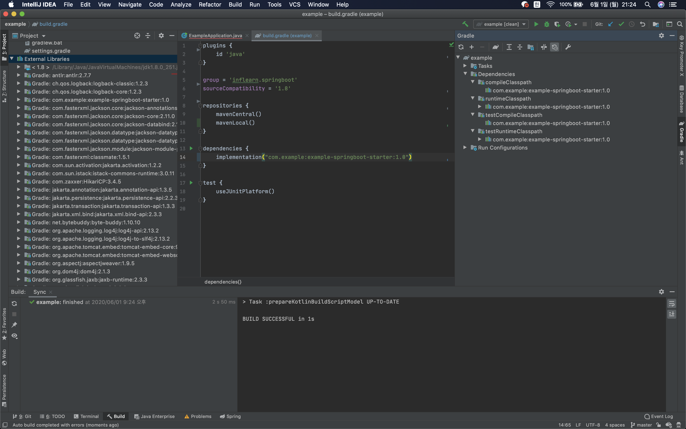

# 0601 스프링 부트 원리

~ 3부. 내장 웹 서버 응용 2부: HTTPS와 HTTP2

## 의존성 관리: spring-boot-dependencies

'io.spring.dependency-management' 플러그인의 추가를 통해 자동적으로 버전을 관리함

버전을 명시함으로 다른 버전을 사용할 수도 있다.

각 버전은 spring-boot 저장소에서 확인할 수 있다.  
[spring-boot-dependencies 2.3.x](https://github.com/spring-projects/spring-boot/tree/2.3.x/spring-boot-project/spring-boot-dependencies)

## 로컬 내 별도 gradle 프로젝트를 통한 autoconfiguration

~~의존성 추가도 하고 싶었는데 안되더라~~

의존성을 관리할 프로젝트의 build.gradle에서 maven 플러그인을 추가한다.  
gradle-other-install을 통해 mavenLocal에 해당 의존성을 저장한다 (build 폴더에서 보면 해당 maven 파일이 생성되어 있다.)

```groovy
// in example-springboot-starter
plugins {
  id 'maven'
}

group = com.example
version = 1.0
```
```properties
# resources/META-INF/spring.factories를 추가하고 설정한다.
org.springframework.boot.autoconfigure.EnableAutoConfiguration=\
  com.example.ExampleConfiguration
```

의존성을 호출할 프로젝트의 build.gradle에서 mavenLocal() 저장소를 추가하고 지정한 groupId:name:version에 맞춰 의존성을 추가한다.

```groovy
//in example
dependencies {
  implementation('com.example:example-springboot-starter:1.0')
}
```
위의 방법을 통하여 생성한 프로젝트의 클래스를 불러올 수 있다.

Spring Boot는 ComponentScan 이후 autoconfiguartion의 spring.factories를 불러오기 때문에, @ConditionalOnMissingBean 등으로 중복에 대한 방지를 해주지 않으면 오류가 발생할 수 있다.

외부 프로젝트에 대한 의존성을 추가했을 때, 해당 외부 프로젝트에 넣은 의존성들까지 불러오지는 않는다.  
외부 라이브러리는 추가되어도 gradle의 내부 의존성은 추가되지 않는다. ~~왜지~~

좌측 외부 라이브러리엔 추가되었지만 우측 gradle에는 추가 안됨

## @ConditionalOn~(.class)

특정 상황에 따라 빈을 등록

@ConditionalOnMissingBean
 - 해당 빈이 없으면(.class) / 같은 값을 반환하는 빈이 없으면 => 빈 등록
 - 있으면 등록 안함

## 내장 서블릿 컨테이너

스프링 부트 자체는 서버가 아니다.
  1. 톰캣 객체 생성
  2. 포트 설정
  3. 톰캣에 컨텍스트 추가
  4. 서블릿 만들기
  5. 톰캣에 서블릿 추가
  6. 컨텍스트에 서블릿 맵핑
  7. 톰캣 실행 및 대기  
  
이 모든 과정을 보다 상세히 또 유연하고 설정하고 실행해주는게 바로 스프링 부트의 자동 설정.  
=> 스프링 부트 자체가 서버는 아니다. 내장되어있는 서버(톰캣)을 실행해줄 뿐이다.