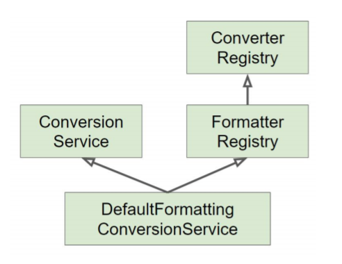

# 스프링 핵심 기술

# IOC 컨테이너

Application 컴포턴트의 중앙 저장소
⇒ 빈 설정 소스를 읽어 빈을 구성 (ApplicationContext, ComponentScan)

## 빈 @Bean

**의존성 관리** 용이 ⇒ 외부 라이브러리들을 빈 등록하여 사용

### **@Scope - Singleton Prototype ...**

Default == Singleton

Application 내부에서 Singleton으로 사용할지 매번 새 인스턴스(Prototype)를 생성할지 정할 수 있다.  
그 외에도 Request, Session 별로 인스턴스 생성이 가능하다.

- Singleton in Prototype - 문제 없음! 각기 다른 인스턴스가 같은 인스턴스를 이용
- Prototype in Singleton
  - Singleton이 초기에 생성되므로 당시 생성된 Prototype 인스턴스만 사용하게 됨
   - Proxy패턴을 통해서 업데이트 가능  
   ⇒ Singleton에서 호출할 때마다 새로운 Prototype 인스턴스 생성

    ```java
    // in Prototype
    @Scope(value = "prototype", proxyMode = ScopedProxyMode.TARGET_CLASS)
    public class Proto { ... }

    // in Singleton 변수 선언부
     private ObjectProvider<Proto> proto;
    ```

### LifeCycle - @PostConstruct @PreDestroy ...

빈의 생성 주기별로 동작을 미리 지정할 수 있다.

### vs @Component

직접 컨트롤 가능한 class는 `@Component`를 선언  
`@Bean`과 동일한 어노테이션을 대부분 사용할 수 있다.

## @AutoWired

의존성 자동 주입!  
주로 생성자에서 사용되며(생략됨) setter를 통해서도 사용할 수는 있다.

```java
// in Service.java

///////////////////////////// 변수 선언
@Autowired
private Repo repo; // final 못붙임!

//////////////////////////// constructur
private final Repo repo;

// @Autowired 생략 가능
public Service(Repo repo) {
	this.repo = repo;
}

//////////////////////////// setter
private Repo repo;

@Autowired
public void setRepo(Repo repo) {
	this.repo = repo;
}
```

### ~(requied = false)

autowired 도중 해당 빈이 없으면 의존성 주입을 하지 않고 인스턴스 생성

### @Primary

같은 인터페이스를 상속받는 빈이 2가지 이상이고 다른 빈에서 부모 인터페이스를 통해 의존성 주입을 바랄 때 어떤 빈을 불러올지 몰라서 오류가 뜬다!

두 개의 빈 중 원하는 빈에 `@Primary`를 추가하면 해당 빈을 호출하게 된다.

### @Qualifier

@Primary를 지정하지 않고 호출하는 부분에서 `@Qualifier`를 통해서 어느 빈을 호출할지 정할 수 있다.

### 여러 빈 모두 주입받기

빈을 List로 호출한 뒤 의존성 주입을 요청하면 모든 빈의 의존성 주입을 실행한다!  
각 빈에 `@Order`를 추가해 순서를 지정할 수 있다.

## @Profile

각 클래스에 `@Profile("name")`을 추가해 읽어들일 컴포넌트 / 빈 그룹을 설정할 수 있다.

`@ActiveProfiles("name")`을 통해 어느 그룹을 읽어들일지 설정 가능

배열 형식을 통해 한번에 여러개의 프로파일 그룹을 설정 가능하다. 

`"!name"`을 통해 profile이 name이 아닐 때만 빈 등록이 가능하게 할 수 있다.  
`!, &, |` 사용이 가능하다. 각각 not, and, or

## @MessageSource

message_ko_kr.properties / message_eu.properties

여러 국가에 배포할 때 국가별로 메세지를 다르게 설정할 수 있다. ⇒ 오류 메세지 등 적용 가능  
근데 아무리 생각해도 프론트에서 별도의 템플릿 만들어서 대처할 거 같다.

## ApplicationEventPublisher

```java
public class MyEvent { ... }
```

```java
@Component
public class EventHandler {

	@EventListener
	public void handle(MyEvent event) {
		// event 발생 시 동작
	}
}
```

```java
@Autowired
ApplicationEventPublisher eventPublisher;

// 이벤트 발생! => EventHandler.handle() 동작
public void method() {
	eventPublisher.publishEvent(new MyEvent());
}
```

같은 Event를 받는 EventListenr가 두개 이상이라도 Event 발생 시 모두 실행된다.

**옵저버 패턴**의 구현체이다! ⇒ 특정 객체의 상태 변화 시 특정 로직 수행 가능

---

# 데이터 바인딩

사용자 입력 값에 따라 도메인 모델에 동적으로 변환해 저장
⇒ `String` to `Object`, `Object` to `String`

## ~~PropertyEditor~~

non-thread-safe! 쓰지 말자

## `Converter<S, T>`

`S.class` to `T.class`

```java
public class StringToEventConverter implements Converter<String, Event> {

	@Override
	public Event convert(String source) {
		Event event = new Event();
		event.setId(Integer.parseInt(source));
		return event;
	}
}
```

빈 등록 가능 ⇒ 자동 등록됨

## `Formatter<Object>`

PropertyEditor의 대체제

`Object` to `String`의 변화 담당

```java
@Compnent
public class EventFormatter implements Formatter<Event> {

	@Override
	public Event parse(String text, Locale locale) throws ParseException {
		Event event = new Event();
		int id = Integer.parseInt(text);
		event.setId(id);
		return event;
	}

	@Override
	public String print(Event object, Locale locale) {
		return object.getId().toString();
	}
}
```

빈 등록 가능 ⇒ 자동 등록됨

## ConversionService



실제 변환 작업을 실행하는 인터페이스

구현체 : `DefaultFormattingConversionService`  
⇒ 기본 Converter, Formatter 포함

---

# SpEL (Spring Expression Language)

[Core Technologies](https://docs.spring.io/spring/docs/current/spring-framework-reference/core.html#expressions)  
[Spring Expression Language Guide | Baeldung](https://www.baeldung.com/spring-expression-language)

스프링 프로젝트 전반에 사용 가능한 표현식

```java
ExpressionParser parser = new SpelExpressionParser();

// invokes 'getBytes().length'
Expression exp = parser.parseExpression("SpEL"); 
Object result = (Object) exp.getValue();
```

⇒ 결과값을 가져올 수 있다!

`#{"표현식"}`, `${"프로퍼티"}`
표현식 내부에선 프로퍼티 사용 가능, 프로퍼티 내부에선 표현식 사용 불가

어노테이션 내부에서도 사용할 수 있다.

@Value("#{'**SpEL**'}")   
Spring Data : @Query("#{'**SpEL**'}")  
Spring Security 이곳저곳

---

# Spring AOP (Aspect-oriendted)

⇒ 관점 지향 프로그래밍?

[AOP 정리(조졸두)](https://jojoldu.tistory.com/69?category=635883)

OOP를 보완하기 위해서 나온 개념

**기능의 재사용성**에 집중
⇒ 어플리케이션 내부에서 기능적으로 공통되는 부분을 추상화하여 재사용 가능하게 함 (Cross-Cutting)

## 용어

Aspect - 추상화된 기능  
Target - Aspect의 사용처  
Advice - 구체화된 Ascpect  
Join point - Advice가 Target에 적용되는 시점  
Pointcut - Join point의 명세

## 적용 시점

컴파일 시점

컴파일 시 Aspect가 포함된 바이트 코드로 컴파일AspectJ로 **컴파일을 한번 더 진행**해야 함. 하지만 런타임에는 부하가 없음.

로드 타임(Load Time Weaving)

바이트 코드에는 Aspect가 포함되어 있지 않고 **클래스 파일을 로드하는 시점**에 Weaving하여 로드함 (JVM 메모리 상에서는 포함되어 로드됨)
Java Agent 설정, Load Time Weaver 등 별도의 설정이 필요. 클래스 로드 시점에서 약간의 부하.

**런타임 (Spring AOP)**

해당 타입의 클래스를 **빈으로 만드는 과정**에서 해당 타입의 Proxy Bean을 만든다
Bean을 생성할 때 약간의 부하

## AOP 적용 방법

[AOP 정리 (3)](https://jojoldu.tistory.com/71?category=635883)

```java
@Component
@Aspect
public class ExampleAspect {

	@Around(" ~ ") // 적용 범위
	public Object method(ProceedingJoinPoint pjp) throws Throwable{
		// before method
		~

		// run method
		Object value = pjp.proceed(); // try ~ catch 가능

		// after method
		~

		return value;
	}
}
```

### 적용 시점 구분

`@Around` 메소드 실행 전, 후  
`@Before` 메소드 실행 전  
`@After` 메소드 실행 후  
`@AfterReturning` 정상적 반환 이후  
`@AfterThrowing` 예외 발생 이후

### 적용 대상 구분 - Pointcut

`excution(* com.journaldev.spring.service.*.get*())`  
spring.service 하위 패키지의 모든 getter함수  
⇒ 접근 제어자 / 반환 타입 / 대상 범위 / 인자

- 접근 제어자 생략 가능 ⇒ 무관
- *을 통해 반환 타입 무관하게 설정 가능
- 대상 범위 생략 가능 ⇒ 전범위, 함수명만 따로 표현 가능
패키지 범위 지정, *을 통해 하위(혹은 일부) 모두 포함 가능
`get*`처럼 함수 일부만 표현 가능
- (..)을 통해 인자 무관하게 설정 가능

`@annotation(org.springframework.transaction.annotation.Transactional)`  
@Transactional이 적용된 모든 메소드  
⇒ 커스텀한 어노테이션을 통해 더욱 다양한 설정이 가능하다!

`within(com.journaldev.spring.service.*)`  
spring.service 하위 모든 클래스의 메소드 ⇒ **하위 패키지 포함 x**   
⇒ **패키지, 클래스까지만** 설정 가능, 메소드 세부 사항 설정 불가

- 마지막에 .*대신 ..을 쓴다면 하위 패키지 역시 포함!

`bean(service)`  
service 빈을 가진 모든 클래스의 모든 메소드

```java
@Before("getNamePointcut()")
public void loggingAdvice(){
	System.out.println("Executing loggingAdvice on getName()");
}
	
@Before("getNamePointcut()")
public void secondAdvice(){
	System.out.println("Executing secondAdvice on getName()");
}
	
@Pointcut("execution(public String getName())")
public void getNamePointcut(){}
```

⇒ 중복되는 포인트컷에 대해 별도 선언 후 재사용 할 수 있다!

---

# Null-Safety

**@NonNull, @Nullable**
스프링5에 추가된 null 어노테이션들

IntelliJ : Preference / Build... / Compiler에서 어노테이션 설정]

패키지 전체에 NonNull 적용 : @NonNullApi  
⇒ 허용하는 곳에만 @Nullable